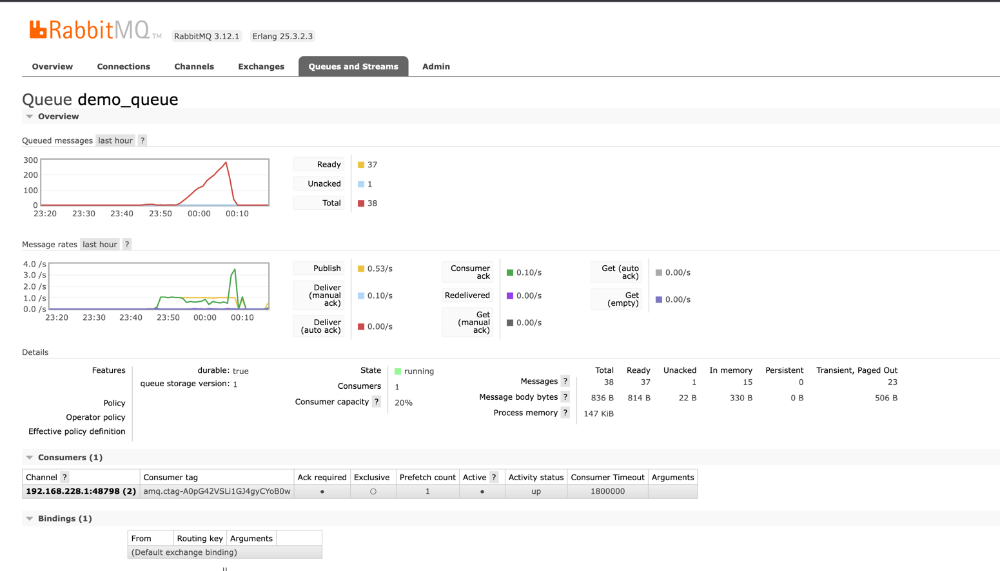

## Description
本项目是一个基于 Nest 框架的定时任务框架，主要用于解决外部取数时任务的容错、横向拓展、监控等问题

## Features
- [x] 定时任务
- [x] 任务容错
- [x] 任务横向拓展
- [x] 任务日志
- [x] 任务监控

## Installation
本项目基于 Nest 框架开发，仅依赖于 RabbitMQ 组件

安装 RabbitMQ
```bash
$ docker-compose up -d
```

安装项目依赖
```bash
$ npm install
```

## Running the app
启动 api-adapter 服务
```bash
# development
$ npm run start

# watch mode
$ npm run start:dev

# production mode
$ npm run start:prod
```
服务启动后，会自动创建 RabbitMQ 队列，队列名称为：`demo_queue`，打开 [RabbitMQ](http://localhost:15672/) 管理界面，可以查看到队列信息和消费速率




## Quickly Start
项目提供了一个 Demo：src/adapter/demo.adapter.ts
```typescript
export class DemoAdapter extends BaseAdapter {
    // 定义队列名称，也就是任务名称
    queueName = 'demo_queue'
    // 定义日志，context 为当前类名
    logger = new Logger('DemoAdapter')


    /**
     * 初始化任务，将每个任务发送到 MQ
     * 尽量将每个任务的粒度拆细
     * @param args
     */
    @Cron('* * * * * *')
    async initTasks(args: {}): Promise<void> {
        const datas = lodash.range(10).map(() => Date.now())
        await Bluebird.map(datas, async (data) => {
            await this.sendToMq({data})
        }, {concurrency: 1})
    }

    /**
     * 消费任务，从 MQ 拉取任务并执行
     * 大致流程是：从 MQ 拉取任务 -> 解析任务 -> 请求 API -> 处理 API 响应结果
     * @param msg
     */
    async runOneTask(msg: {}): Promise<void> {
        const data = lodash.get(msg, 'data')
        const result = await this.requestAPI(data)
        this.logger.debug(`Fetch api result: [${result}]`)
    }

    /**
     * 请求 API
     * @param msg
     */
    async requestAPI(msg: {}): Promise<any> {
        if (lodash.random(0, 10) > 8) {
            throw new Error('request api error')
        }
        const result = await request.get('http://localhost:3000/hello')
        return result.text
    }

}
```
## Advanced Settings
继承 BaseAdapter 后，可以自定义以下属性
```typescript
  // 消费并发数
  protected concurrentCount = 1
  // 消费异常时重试次数
  protected retryMax = 3
  // delayOnError: 消费异常时等待时间，单位毫秒
  public delayOnError = 1000
  // 消费超出重试次数后，是否重新发送到队列, 等待再次消费
  protected resend = false
```